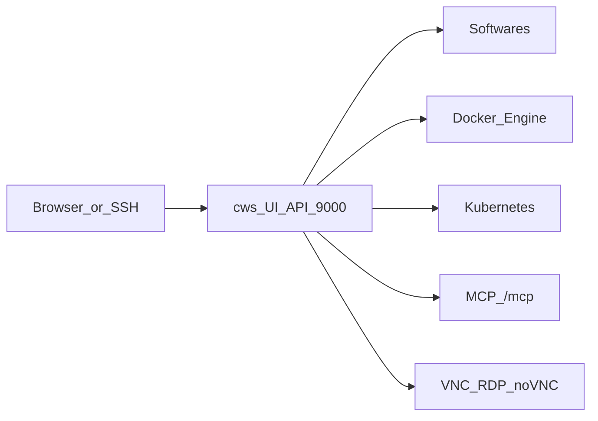

# Introduction

**ContainerWS** (Container Workspace — binary `containerws` / `cws`) is a full Linux workspace: a web UI and API on port **9000**, Softwares catalog, Cloud Shell, MCP tools for agents, nested Docker, optional Kubernetes management, Homebrew integration, and desktop access (XFCE / noVNC / RDP).

**Author:** [Izet Molla](mailto:izetmolla@icloud.com)

Run it as a **native binary** on the host, or as a **Docker image** with OpenSSH and systemd (or direct mode when systemd is unavailable).

## What you get

| Area | Capability |
|------|------------|
| Softwares | Distro-aware catalog install / uninstall / service control |
| Brew | Homebrew search, install, updates (queues into Softwares) |
| Docker | Environments, containers, images, networks, volumes, stacks |
| Kubernetes | Multi-cluster via kubeconfig secrets in the panel |
| MCP | Agent tools on `/mcp` (+ optional standalone `MCP_PORT`) |
| Desktop | XFCE + TigerVNC + noVNC; optional xrdp |
| Users | Panel users synced with Linux accounts |
| Proxy | Host reverse-proxy manager (hosts, SSL, redirects) |

## Choose a run mode

| Mode | Best for |
|------|----------|
| [Native binary](./install/native-binary.mdx) / [Homebrew](./install/homebrew.mdx) | Bare metal or VM; `cws --start` as a daemon |
| [Docker Compose](./install/docker-compose.mdx) / [CLI](./install/docker-cli.mdx) | Isolated workspace with nested Docker |
| [Windows](./install/windows.mdx) | Docker Desktop + named volumes |
| [Linux / WSL](./install/linux-wsl.mdx) | WSL2 with private cgroups |
| [Kubernetes](./install/kubernetes.mdx) | Privileged Deployment (trusted cluster only) |

## Quick links

- [Getting started](./getting-started/overview.mdx)
- [Requirements & security](./getting-started/requirements.mdx)
- [Environment variables](./configuration/environment.mdx)
- [CLI reference](./configuration/cli.mdx)
- [Image tags](./reference/images-tags.mdx)
